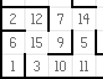

# Micromouse AI

##Project Description

This project takes inspiration from [Micromouse](https://en.wikipedia.org/wiki/Micromouse) competitions, wherein a robot
mouse is tasked with plotting a path from a corner of the maze to its center. The robot mouse may make multiple runs in
a given maze. In the first run, the robot mouse tries to map out the maze to not only find the center but also figure
out the best paths to the center. In subsequent runs, the robot mouse attempts to reach the center in the fastest time 
possible, using what it has previously learned. This [video](https://www.youtube.com/watch?v=0JCsRpcrk3s) is an example
of a Micromouse competition. A simplified model of the world is provided along with specifications for the maze and 
robot; the goal is to obtain the fastest times possible in a series of test mazes.

This project is done as the Capstone Project for [Udacity's Machine Learning Engineer Nanodegree]
(https://www.udacity.com/course/machine-learning-engineer-nanodegree-by-google--nd009).

##Environment Specifications

###Maze Specifications

The maze exists on an n x n grid of squares, n even. The minimum value of n is twelve, the maximum sixteen. Along the 
outside perimeter of the grid, and on the edges connecting some of the internal squares, are walls that block all 
movement. The robot will start in the square in the bottom- left corner of the grid, facing upwards. The starting square
will always have a wall on its right side (in addition to the outside walls on the left and bottom) and an opening on
its top side. In the center of the grid is the goal room consisting of a 2 x 2 square; the robot must make it here from
its starting square in order to register a successful run of the maze.

Mazes are provided to the system via a text file. On the first line of the text file is a number describing the number 
of squares on each dimension of the maze n. On the following n lines, there will be n comma-delimited numbers describing
which edges of the square are open to movement. Each number represents a four-bit number that has a bit value of 0 if an
edge is closed (walled) and 1 if an edge is open (no wall); the 1s register corresponds with the upwards-facing side,
the 2s register the right side, the 4s register the bottom side, and the 8s register the left side. For example, the
number 10 means that a square is open on the left and right, with walls on top and bottom (0*1 + 1*2 + 0*4 + 1*8 = 10).
Note that, due to array indexing, the first data row in the text file corresponds with the leftmost column in the maze,
its first element being the starting square (bottom-left) corner of the maze.



###Robot Specifications

The robot can be considered to rest in the center of the square it is currently located in, and points in one of the
cardinal directions of the maze. The robot has three obstacle sensors, mounted on the front of the robot, its right 
side, and its left side. Obstacle sensors detect the number of open squares in the direction of the sensor; for example,
in its starting position, the robot’s left and right sensors will state that there are no open squares in those 
directions and at least one square towards its front. On each time step of the simulation, the robot may choose to
rotate clockwise or counterclockwise ninety degrees, then move forwards or backwards a distance of up to three units.
It is assumed that the robot’s turning and movement is perfect. If the robot tries to move into a wall, the robot stays
where it is. After movement, one time step has passed, and the sensors return readings for the open squares in the
robot’s new location and/or orientation to start the next time unit.

More technically, at the start of a time step the robot will receive sensor readings as a list of three numbers
indicating the number of open squares in front of the left, center, and right sensors (in that order) to its 
*next_move* function. The *next_move* function must then return two values indicating the robot’s rotation and movement
on that time step. Rotation is expected to be an integer taking one of three values: -90, 90, or 0, indicating a
counterclockwise, clockwise, or no rotation, respectively. Movement follows rotation, and is expected to be an integer
in the range [-3, 3] inclusive. The robot will attempt to move that many squares forward (positive) or backwards
(negative), stopping movement if it encounters a wall.

###Scoring

On each maze, the robot must complete two runs. In the first run, the robot is allowed to freely roam the maze to build
a map of the maze. It must enter the goal room at some point during its exploration, but is free to continue exploring
the maze after finding the goal. After entering the goal room, the robot may choose to end its exploration at any time.
The robot is then moved back to the starting position and orientation for its second run. Its objective now is to go
from the start position to the goal room in the fastest time possible. The robot’s score for the maze is equal to the
number of time steps required to execute the second run, plus one thirtieth the number of time steps required to execute
the first run. A maximum of one thousand time steps are allotted to complete both runs for a single maze.

##Technical Details

###Requirements
    
* Python 2.7.X
* Numpy
* PyGame (optional, used for visualization)

###Files

* *tester.py* - This script will be run to test the robot’s ability to navigate mazes.
* *robot.py* - This script establishes the robot class that implements *next_move* function.
* *simulator.py* - This script can be used to visualize the maze and robot's data.
* *maze.py* - This script contains functions for loading the maze and for checking for walls upon sensing.
* *maze/test_maze_##.txt* - These files provide sample mazes to test the robot.

###Command Line Parameters

To run test use following command line:

```
python tester.py {path to maze file}
```

It's possible to enable visualization of the robot movements by specifying a frame delay:

```
python tester.py {path to maze file} {frame delay in milliseconds}
```

And to display the maze use third boolean parameter:

```
python tester.py {path to maze file} {frame delay in milliseconds} True
```

###Examples

```
mazes/test_maze_01.txt
```

runs test_maze_01.txt with no visualization.

```
mazes/test_maze_02.txt 50
```

runs test_maze_02.txt with robot's data visualization.

```
mazes/test_maze_03.txt 50 True
```

runs test_maze_03.txt with both maze and robot's data visualization.

##Additional Information

Detailed information about implementation and algorithm used can be found in [project report](report.md).
