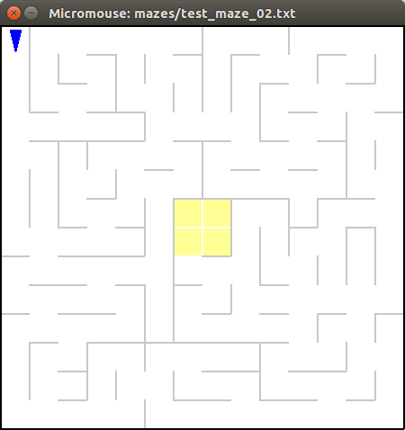
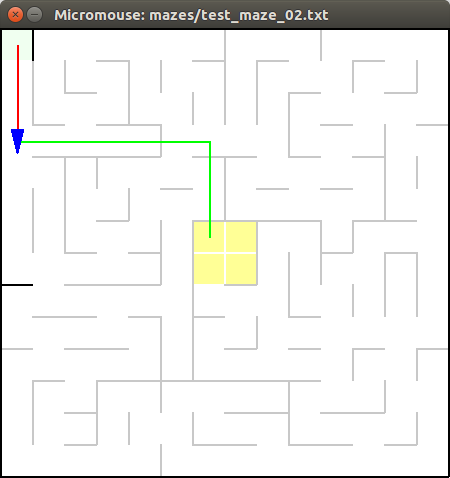
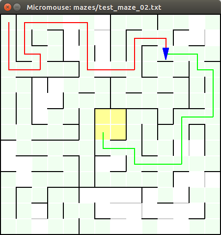
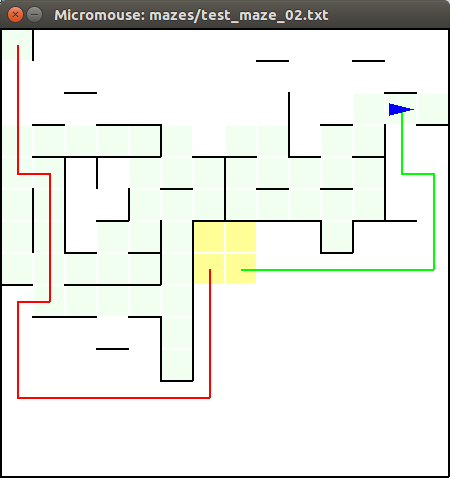
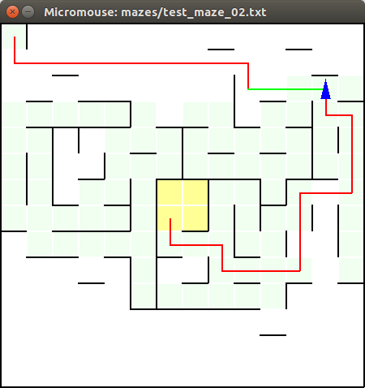
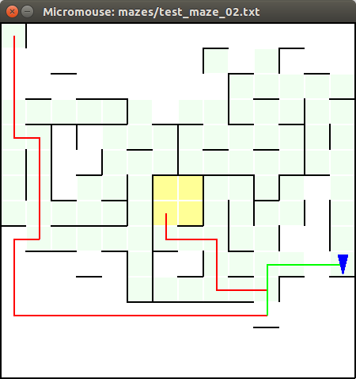
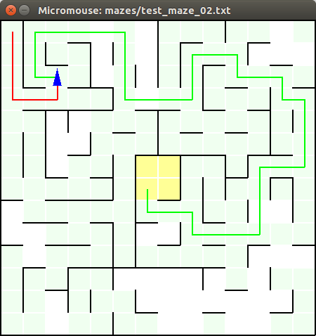
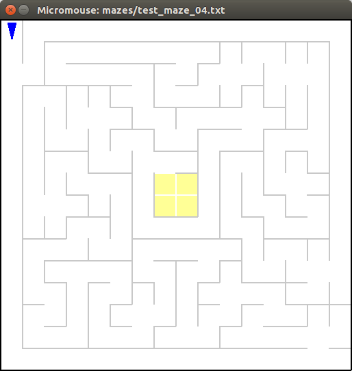
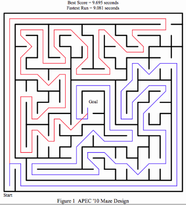
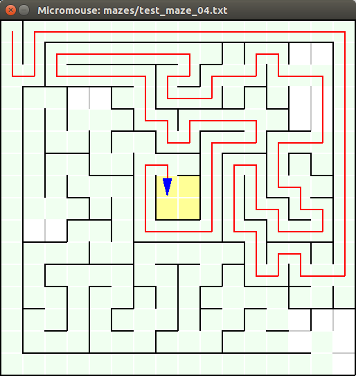

# Capstone Project for Machine Learning Engineer Nanodegree

## I. Definition

### Project Overview

The main idea of this project is finding the optimal solution for a maze in less possible time. An additional challenge 
is that maze is obscured at the beginning and it needs to be investigated first.

As an input maze size, starting point and the goal bounds are given. Using a robot that can move, rotate and measure 
a distance to walls it's necessary to find a goal on the first run and uncover maze enough to find an optimal way. During 
second run the robot can just follow the optimal path. 

As an output at every step, the robot needs to provide rotation and movement relatively to its current position.

Environment and robot's movements are discrete and deterministic. One move is taken as a time unit. 

### Problem Statement

An amount of time spent for both runs are used to evaluate robot's strategy but the second run has the most significant 
impact on result score. That means it is vital to find an (almost) optimal path on the first run. Also, it's required
that the robot visits the goal bounds at the first run as well.

At the beginning, the robot does not have any information about the maze except the size of the maze. On every step 
using information from the sensors the robot needs to build an internal representation of the maze and keep track on its
own location and heading. It will allow to find an optimal way to the goal and follow it on the second run.

As the tester script verifies robot's movement and does not allow to make illegal moves it also makes sense to verify 
them on robot's side to avoid time wasting on redundant/illegal movements.

### Metrics

To evaluate performance, time that robot used for each run is measured. Final performance score is calculated based on 
formula:
 
```
final score = time spent on the second run + time spent on the first run / 30
```

Where a time unit is one robot's move. It clearly shows that it's better to spend up to 30 additional moves during 
exploring phase rather than one additional move during the last run.

Also, all moves are validated and illegal ones are corrected/prohibited.

## II. Analysis

### Data Exploration

The robot can change its heading by rotating to the left and the right and can move up to 3 cells at the same time. 
These abilities allow to navigate through a maze and explore it.

First, the robot knowing its location and heading can apply sensors data to update maze's map. Second, the map is used 
to get a list of available moves from the current location and the robot can choose the most valuable one based on policy 
calculated.

During policy calculation process it's necessary to take into account that the robot can move up to 3 cells, it means 
that the shortest way (in terms of a number of cells) is not always the fastest. It's also assumed that all walls are 
already uncovered so calculated optimal policy can be used as a heuristic function to find the best next move.

When the robot reaches the goal bounds the optimal path is still unknown so the robot needs to investigate it further.

Also there some interesting points about the mazes that should be taken into account. **test_maze_02.txt** is taken as 
example:

- A goal is not a single cell but some bounds, it means that robot can aim any of cell from this bounds.
- The goal bounds have only one entrance but it's not a rule and needs to be verified by the robot, that is why the
robots check all walls within the goal bounds as soon as it reaches them.
- a maze could have multiple more or less equal paths. For example, **test_maze_02.txt** the goal bounds can be reached
following south and then east or first east and then south directions. Without investigating both it's hard to say 
which one is optimal.

Having full maze's map it's possible to calculate the optimal path for it. And it equals to 22 for **test_maze_02.txt**.

### Exploratory Visualization

For visualization the **simulator.py** script was created. It allows displaying maze structure along with some additional 
robot's data. Check [readme](README.md) for usage details. **Be aware that vertical coordinates are mirrored**.

At the beginning, it shows maze structure (gray lines), the goal bounds (yellow squares) and initial robot's location 
(blue triangle)



When the robot starts moving and processing sensors data, more information is available:



Black lines show already uncovered walls, the red line is an estimated path from the initial cell and the green one is 
the path to current robot's goal (will be discussed in details later in *Implementation* section).

At the end, a maze is almost fully investigated and the optimal path is uncovered so the robot just follows it:



The resulted optimal path has a length of 22 that equals to predicted value.  

### Algorithms and Techniques

Following tasks need to be solved to achieve the goal:
 
- build an internal maze's map, based on data from sensors 
- compute a policy to reach the goal, based on the maze's map
- find a next move, based on the policy
- update robot's position, based on the next move

To solve the tasks following techniques are used:

- The maze's map is a dictionary where keys are wall coordinates (calculated from cell coordinates and direction) and
values are presence or absence of a wall. If some key is missing in the dictionary it means that information about 
this specific wall is not available yet.
- The policy is a list of heading and movement for every cell in the maze which the robot hast to follow to reach the 
goal in fastest time. It's calculated using Flood Fill algorithm. Every time a new wall is uncovered the optimal policy 
is recalculated.
- The next move can be easily found based on current robot's heading, location and the policy for the robot's current
location.
- The sensors data along with the next move are used to update robot's state. It allows to apply environment 
restrictions and avoid illegal moves.

### Benchmark

First, the robot has to avoid any illegal moves. The tester script informs about an illegal move via console message. 
Having any such messages indicates that implemented algorithm doesn't perform well.

Also, time to follow an optimal path (that is calculated on real maze data) can be used as a lower bound. The best case 
scenario is when the robot follows an optimal path on both run so the best score for the specific maze is:
 
```
the best score (lower bound) = the optimal time + the optimal time / 30 
``` 

Where *an optimal time* is calculated for the specific maze.

For upper bound (the worst case) it can be assumed that on the first run the robot visits all cells in the maze and 
having full maze's map can follow an optimal path on the second run. It means that:

```
upper bound = the optimal time + number of cells in the maze / 30
```

It's still approximation but an algorithm is likely bad one if the robot achieves a score higher than an upper bound.

The **tester.py** script was modified to calculate lower and upper bounds for every maze and print a result similar to:

```
Estimated score is between 17.567 and 21.800  
```

## III. Methodology

### Data Preprocessing

No additional data preprocessing is required for this project. 

* The **maze.py** script allows reading maze data file.
* Sensors data is prepared and provided by the **tester.py** script.
* All robot's moves are evaluated by the **tester.py** script.

### Implementation

The robot's algorithm is split into three different phases:

- *Exploring phase*, during this stage the robot is aiming the goal bounds and is following policy. If a new is found 
the policy is recalculated. The path discovered during this phase is not optimal.
- *Validating phase*, the robot discovers all walls within the goal bounds and then checks all unvisited cells in an
estimated optimal path in reverse order. If a new wall found and a new optimal path is computed the robot checks cell 
from the new path. When there are no unvisited cells from the optimal path the robots resets to initial position.
- *Testing phase*, the robot follows the optimal path discovered in the previous phase.

Following algorithm allows to solve all three test mazes within 1000 moves limit and achieve a score that fits between
proposed lower and upper bound, see *Benchmark* section.

An example of the *Exploring phase*:



The red line shows estimated optimal path from the initial cell. The green line is an optimal path to the goal bounds 
starting from current robot's location. 

An example of the *Validating phase*:



The red line shows estimated optimal path from the initial cell. The green line is a path to the last unvisited cell in 
the estimated optimal path. 



A new wall was discovered that caused recalculation of the estimated path and robot's path as well.

An example of the *Testing phase*:



The robot starts from the initial point and follows the optimal path.

### Refinement

The initial solution used Flood Fill algorithm to find a way to the goal bounds. Then the robot follows the same path on 
the second run. It showed following results for three test mazes:

* test_maze_01.txt:

*Estimated score is between 17.567 and 21.800  
Task complete! Score:* **25.667**

* test_maze_02.txt:

*Estimated score is between 22.733 and 28.533  
Task complete! Score:* **45.500**

* test_maze_03.txt:

*Estimated score is between 26.867 and 34.533  
Task complete! Score:* **77.400**

The results were far away from the optimal as no optimal path was found.

On next step, the robot followed an optimal path. As an optimal path was recalculated the robot needed to go back to the 
last visited cell that belonged to the newly calculated path. Following result were achieved:

* test_maze_01.txt:

*Estimated score is between 17.567 and 21.800  
Task complete! Score:* **21.267**  

* test_maze_02.txt:

*Estimated score is between 22.733 and 28.533  
Task complete! Score:* **27.700**

* test_maze_03.txt:

*Estimated score is between 26.867 and 34.533  
Task complete! Score:* **32.867**

The results were within estimated bounds but the robot did lots of moves because an optimal path was recalculated very 
often when a new wall was discovered. 

In final solution the robot, first, finds a way to goal bounds then follows the estimated optimal path in reverse order.

* test_maze_01.txt:

*Estimated score is between 17.567 and 21.800  
Task complete! Score:* **20.967** 

* test_maze_02.txt:

*Estimated score is between 22.733 and 28.533  
Task complete! Score:* **27.700**

* test_maze_03.txt:

*Estimated score is between 26.867 and 34.533  
Task complete! Score:* **30.667**

This approach reduces the number of steps needed to discover an optimal path and improves results for some mazes.

## IV. Results

### Model Evaluation and Validation

The algorithm applied uncovers enough cells to be sure that a path found is optimal path. It gives assurance that the 
robot uses as less time for the second run as possible. On the other side, the robot does lots of moves to uncover all 
cells in the optimal path during the first run and this part can more likely be improved. Unfortunately, no algorithm
was found that worked better for different mazes.

There could be also another algorithm that doesn't find the optimal path but uses much less moves during the first run.
The criteria can be used that says that further investigating will cost more moves than the benefits it can bring. 
Existing of such algorithm was neither confirmed nor refuted.
   
It all leads to conclusion that implemented algorithm is robust and good enough for different mazes but not the best 
possible one.

### Justification

The following results were achieved for given mazes:

* test_maze_01.txt:

*Estimated score is between 17.567 and 21.800  
Starting run 0.  
Ending first run. Starting next run.  
Starting run 1.  
Goal found; run 1 completed!  
Task complete! Score:* **20.967** 

* test_maze_02.txt:

*Estimated score is between 22.733 and 28.533  
Starting run 0.  
Ending first run. Starting next run.  
Starting run 1.  
Goal found; run 1 completed!  
Task complete! Score:* **27.700**

* test_maze_03.txt:

*Estimated score is between 26.867 and 34.533  
Starting run 0.  
Ending first run. Starting next run.  
Starting run 1.  
Goal found; run 1 completed!  
Task complete! Score:* **30.667**

The algorithm shows good results. And the scores for all three mazes fit into the estimated intervals.

The result for the **test_maze_02.txt** maze is interesting as it shows that the algorithm has weak points in case a 
maze has more or less equal paths to the goal bounds, so the algorithm needs to check all by frequently switching 
between them.

## V. Conclusion

### Free-Form Visualization

To demo weak points of the algorithm used following maze was created:



It copies maze used in APEC'10 competition:



It has two almost equal paths (108 cell for the blue one and 110 - for the red one) that are separated as much as
possible.
 
As result the robots chose the blue (shortest path) and achieved following result:



*Estimated score is between 63.033 and 69.533  
Starting run 0.  
Ending first run. Starting next run.  
Starting run 1.  
Goal found; run 1 completed!  
Task complete! Score:* **71.033**

It clearly shows that algorithm can't decide between two paths and constantly switching between them.

### Reflection

Finding a way to the goal bounds is a relatively easy task. The most challenging task is finding the optimal way not 
having full maze's map. That is why the robot needs to spend additional time to investigate the maze even if it reaches 
the goal bounds.

The most complex mazes are ones that have more than one way to the goal bounds with more or less equal length. Every 
time the robot discovers a new wall an optimal time switches and it requires additional robot movements, see results for
*test_maze_02.txt* as an example. No good solution for such mazes was found.

Also, it appears important to investigate all cells within goal bounds. It significantly reduces the number of possible 
paths later when the robot starts validating estimated optimal path.

### Improvement

Implemented algorithm can be also applied in a continuous domain as far as all cells have the same size and all walls 
have the same thickness. In this case, an additional level of abstraction can be built to hide continuous nature of the 
environment.

Also following steps can be done to improve algorithm and allow it to be used in real world (stochastic environment):

- Data preprocessing is required for sensors data.
- The algorithm has to deal with measurement and movement errors. In other words, it has to work with probabilities 
instead of deterministic values.

Another field for improvements is a performance of algorithm itself. Some additional optimizations can be applied in a 
case when computation time is important or resources are limited. For an example, it's possible to recalculate only policies 
for affected cells (not for all cells as it's done now) when a new wall is discovered.