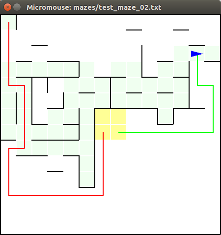
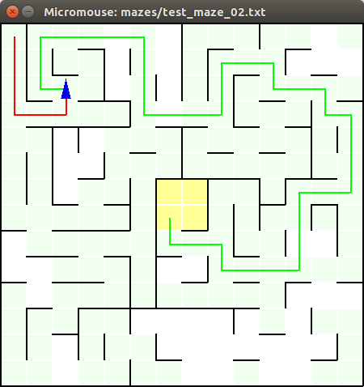

# Capstone Project
## Machine Learning Engineer Nanodegree

## I. Definition

### Project Overview

The main idea of this project is finding the optimal solution for a maze in less possible time. An additional challenge 
is that maze is obscured at the beginning and it needs to be investigated first.

As an input maze size, starting point and the goal bounds are given. Using a robot that can move, rotate and measure 
a distance to walls it's necessary to find a goal on the first run and uncover maze enough to find an optimal way. During 
second run the robot can just follow the optimal path. 

As an output at every step, the robot needs to provide rotation and movement relatively to its current position.

Environment and robot's movements are discrete and deterministic. One move is taken as a time unit. 

### Problem Statement

Amount of time spent for both runs are used to evaluate robot's strategy but the second run has the most significant 
impact on result score. That means it is vital to find an (almost) optimal path on the first run. Also, it's required
that the robot visits the goal bounds at the first run as well.

At the beginning, the robot does not have any information about the maze except the size of the maze. On every step 
using information from the sensors the robot needs to build an internal representation of the maze and keep track on its
own location and heading. It will allow to find an optimal way to the goal and follow it on the second run.

As the tester script verifies robot's movement and does not allow to make illegal moves it also makes sense to verify 
them on robot's side to avoid time wasting on redundant/illegal movements.

### Metrics

To evaluate performance, time that robot used for each run is measured. Final performance score is calculated based on 
formula:
 
```
final score = time spent on the second run + time spent on the first run / 30
```

Where a time unit is one robot's move. It clearly shows that it's better to spend up to 30 additional moves during 
exploring phase rather than one additional move during the last run.

Also, all moves are validated and illegal ones are corrected/prohibited.

## II. Analysis

### Data Exploration

**TODO**

In this section, you will be expected to analyze the data you are using for the problem. This data can either be in the form of a dataset (or datasets), input data (or input files), or even an environment. The type of data should be thoroughly described and, if possible, have basic statistics and information presented (such as discussion of input features or defining characteristics about the input or environment). Any abnormalities or interesting qualities about the data that may need to be addressed have been identified (such as features that need to be transformed or the possibility of outliers). Questions to ask yourself when writing this section:
- _If a dataset is present for this problem, have you thoroughly discussed certain features about the dataset? Has a data sample been provided to the reader?_
- _If a dataset is present for this problem, are statistics about the dataset calculated and reported? Have any relevant results from this calculation been discussed?_
- _If a dataset is **not** present for this problem, has discussion been made about the input space or input data for your problem?_
- _Are there any abnormalities or characteristics about the input space or dataset that need to be addressed? (categorical variables, missing values, outliers, etc.)_

**Data Exploration: Use the robot specifications section to discuss how the robot will interpret and explore its environment. Additionally, one of the three mazes provided should be discussed in some detail, such as some interesting structural observations and one possible solution you have found to the goal (in number of steps). Try to aim for an optimal path, if possible!**

### Exploratory Visualization

**TODO**

In this section, you will need to provide some form of visualization that summarizes or extracts a relevant characteristic or feature about the data. The visualization should adequately support the data being used. Discuss why this visualization was chosen and how it is relevant. Questions to ask yourself when writing this section:
- _Have you visualized a relevant characteristic or feature about the dataset or input data?_
- _Is the visualization thoroughly analyzed and discussed?_
- _If a plot is provided, are the axes, title, and datum clearly defined?_

**Exploratory Visualization: This section should correlate with the section above, in that you should provide a visualization of one of the three example mazes using the showmaze.py file. Your explanation in Data Exploration should coincide with the visual cues from this maze.**

### Algorithms and Techniques

Following tasks need to be solved to achieve the goal:
 
- build an internal maze's map, based on data from sensors 
- compute a policy to reach the goal, based on the maze's map
- find next move, based on the policy
- update robot's position, based on the next move

To solve the tasks following techniques are used:

- The maze's map is a dictionary where keys are wall coordinates (calculated from cell coordinates and direction) and
values are presence or absence of a wall. If some key is missing in the dictionary it means that information about 
this specific wall is not available yet.
- The policy is a list of policies for every cell in the maze. It's calculated using Flood Fill algorithm. Every time a 
new wall is uncovered the optimal policy is recalculated.
- The next move can be easily found based on current robot's heading, location and the policy for the robot's current
location.
- The sensors data along with the next move are used to update robot's state. It allows to apply environment 
restrictions and avoid illegal moves.

### Benchmark

First, the robot has to avoid any illegal moves. The tester script informs about an illegal move via console message. 
Having any such messages indicates that implemented algorithm doesn't perform well.

Also, an optimal path (that is calculated on real maze data) can be used as a lower bound. The best case scenario is when 
the robot follows an optimal path on both run so the best score for the specific maze is:
 
```
the best score (lower bound) = the optimal time + the optimal time / 30 
``` 

Where *an optimal time* is calculated for the specific maze.

For upper bound (the worst case) it can be assumed that on the first run the robot visits all cells in the maze and 
having full maze's map can follow an optimal path on the second run. It means that:

```
upper bound = the optimal time + number of cells in the maze / 30
```

It's still approximation but an algorithm is likely bad one if the robot achieves a score higher than an upper bound.

The **tester.py** script was modified to calculate lower and upper bounds for every maze and print a result similar to:

```
Estimated score is between 17.567 and 21.800  
```

## III. Methodology

### Data Preprocessing

No additional data preprocessing is required for this project. 

* The **maze.py** script allows reading maze data file.
* Sensors data is prepared and provided by the **tester.py** script.
* All robot's moves are evaluated by the **tester.py** script.

### Implementation

The robot's algorithm is split into three different phases:

- *Exploring phase*, during this stage the robot is aiming the goal bounds and is following policy. If a new is found 
the policy is recalculated. The path discovered during this phase is not optimal.
- *Connecting phase*, the robot discovers all walls within the goal bounds and then checks all unvisited cells in an
estimated optimal path in reverse order. If a new wall found and a new optimal path is computed the robot checks cell 
from the new path. When there are no unvisited cells from the optimal path the robots resets to initial position.
- *Testing phase*, the robot follows the optimal path discovered in the previous phase.

Following algorithm allows to solve all three test mazes within 1000 moves limit and achieve a score that fits between
proposed lower and upper bound, see *Benchmark* section.

An example of the *Exploring phase*:



The red line shows estimated optimal path from the initial cell. The green line is an optimal path to the goal bounds 
starting from current robot's location. 

An example of the *Connecting phase*:


The red line shows estimated optimal path from the initial cell. The green line is a path to the last unvisited cell in 
the estimated optimal path. 


A new wall was discovered that caused recalculation of the estimated path and robot's path as well.

An example of the *Testing phase*:



The robot starts from the initial point and follows the optimal path.

### Refinement

The initial solution used Flood Fill algorithm to find a way to the goal bounds. Then the robot follows the same path on 
the second run. It showed following results for three test mazes:

* test_maze_01.txt:

*Estimated score is between 17.567 and 21.800  
Starting run 0.  
Ending first run. Starting next run.  
Starting run 1.  
Goal found; run 1 completed!  
Task complete! Score:* **25.667**

* test_maze_02.txt:

*Estimated score is between 22.733 and 28.533  
Starting run 0.  
Ending first run. Starting next run.  
Starting run 1.  
Goal found; run 1 completed!  
Task complete! Score:* **45.500**

* test_maze_03.txt:

*Estimated score is between 26.867 and 34.533  
Starting run 0.  
Ending first run. Starting next run.  
Starting run 1.  
Goal found; run 1 completed!  
Task complete! Score:* **77.400**

The results were far away from the optimal as no optimal path was found.

On next step, the robot followed an optimal path. As an optimal path was recalculated the robot needed to go back to the 
last visited cell that belonged to the newly calculated path. Following result were achieved:

* test_maze_01.txt:

*Estimated score is between 17.567 and 21.800  
Starting run 0.  
Ending first run. Starting next run.  
Starting run 1.  
Goal found; run 1 completed!  
Task complete! Score:* **21.267**  

* test_maze_02.txt:

*Estimated score is between 22.733 and 28.533  
Starting run 0.  
Ending first run. Starting next run.  
Starting run 1.  
Goal found; run 1 completed!  
Task complete! Score:* **27.700**

* test_maze_03.txt:

*Estimated score is between 26.867 and 34.533  
Starting run 0.  
Ending first run. Starting next run.  
Starting run 1.  
Goal found; run 1 completed!  
Task complete! Score:* **32.867**

The results were within estimated bounds but the robot did lots of moves because an optimal path was recalculated very 
often when a new wall was discovered. 

In final solution the robot, first, finds a way to goal bounds then follows the estimated optimal path in reverse order.

* test_maze_01.txt:

*Estimated score is between 17.567 and 21.800  
Starting run 0.  
Ending first run. Starting next run.  
Starting run 1.  
Goal found; run 1 completed!  
Task complete! Score:* **20.967** 

* test_maze_02.txt:

*Estimated score is between 22.733 and 28.533  
Starting run 0.  
Ending first run. Starting next run.  
Starting run 1.  
Goal found; run 1 completed!  
Task complete! Score:* **27.700**

* test_maze_03.txt:

*Estimated score is between 26.867 and 34.533  
Starting run 0.  
Ending first run. Starting next run.  
Starting run 1.  
Goal found; run 1 completed!  
Task complete! Score:* **30.667**

The following approach reduces the number of steps needed to discover an optimal path and improves results for some 
mazes.

## IV. Results

### Model Evaluation and Validation

**TODO**

In this section, the final model and any supporting qualities should be evaluated in detail. It should be clear how the final model was derived and why this model was chosen. In addition, some type of analysis should be used to validate the robustness of this model and its solution, such as manipulating the input data or environment to see how the model’s solution is affected (this is called sensitivity analysis). Questions to ask yourself when writing this section:
- _Is the final model reasonable and aligning with solution expectations? Are the final parameters of the model appropriate?_
- _Has the final model been tested with various inputs to evaluate whether the model generalizes well to unseen data?_
- _Is the model robust enough for the problem? Do small perturbations (changes) in training data or the input space greatly affect the results?_
- _Can results found from the model be trusted?_

**The final model’s qualities — such as parameters — are evaluated in detail. Some type of analysis is used to validate the robustness of the model’s solution.**

### Justification

**TODO**

In this section, your model’s final solution and its results should be compared to the benchmark you established earlier in the project using some type of statistical analysis. You should also justify whether these results and the solution are significant enough to have solved the problem posed in the project. Questions to ask yourself when writing this section:
- _Are the final results found stronger than the benchmark result reported earlier?_
- _Have you thoroughly analyzed and discussed the final solution?_
- _Is the final solution significant enough to have solved the problem?_

**The final results are compared to the benchmark result or threshold with some type of statistical analysis. Justification is made as to whether the final model and solution is significant enough to have adequately solved the problem.**

## V. Conclusion

### Free-Form Visualization

**TODO**

In this section, you will need to provide some form of visualization that emphasizes an important quality about the project. It is much more free-form, but should reasonably support a significant result or characteristic about the problem that you want to discuss. Questions to ask yourself when writing this section:
- _Have you visualized a relevant or important quality about the problem, dataset, input data, or results?_
- _Is the visualization thoroughly analyzed and discussed?_
- _If a plot is provided, are the axes, title, and datum clearly defined?_

**Free-Form Visualization: Use this section to come up with your own maze. Your maze should have the same dimensions (12x12, 14x14, or 16x16) and have the goal and starting positions in the same locations as the three example mazes (you can use test_maze_01.txt as a template). Try to make a design that you feel may either reflect the robustness of your robot’s algorithm, or amplify a potential issue with the approach you used in your robot implementation. Provide a small discussion of the maze as well.**

### Reflection

**TODO**

In this section, you will summarize the entire end-to-end problem solution and discuss one or two particular aspects of the project you found interesting or difficult. You are expected to reflect on the project as a whole to show that you have a firm understanding of the entire process employed in your work. Questions to ask yourself when writing this section:
- _Have you thoroughly summarized the entire process you used for this project?_
- _Were there any interesting aspects of the project?_
- _Were there any difficult aspects of the project?_
- _Does the final model and solution fit your expectations for the problem, and should it be used in a general setting to solve these types of problems?_

**Student adequately summarizes the end-to-end problem solution and discusses one or two particular aspects of the project they found interesting or difficult.**

### Improvement

Implemented algorithm can be also applied in a continuous domain as far as all cells have the same size and all walls 
have the same thickness. In this case, an additional level of abstraction can be built to hide continuous nature of the 
environment.

Also following steps can be done to improve algorithm and allow it to be used in real world (stochastic environment):

- Data preprocessing is required for sensors data.
- The algorithm has to deal with measurement and movement errors. In other words, it has to work with probabilities 
instead of deterministic values.

Another field for improvements is a performance of algorithm itself. Some additional optimizations can be applied in a 
case when computation time is important or resources are limited. For example it's possible to recalculate only policies 
for affected cells (not for all cells as it's done now) when a new wall is discovered.